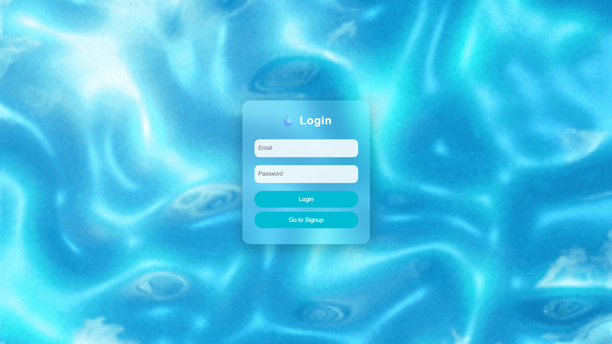
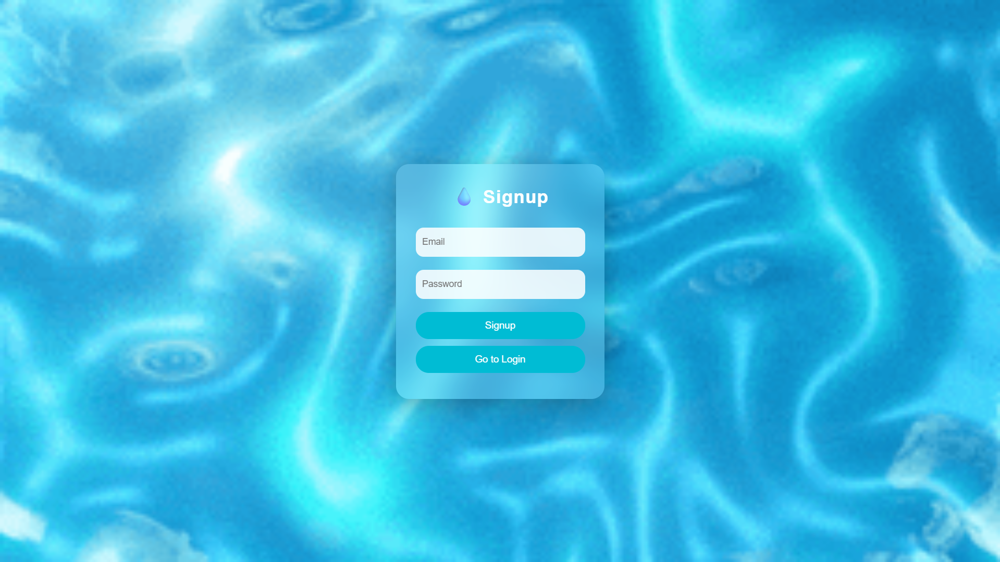
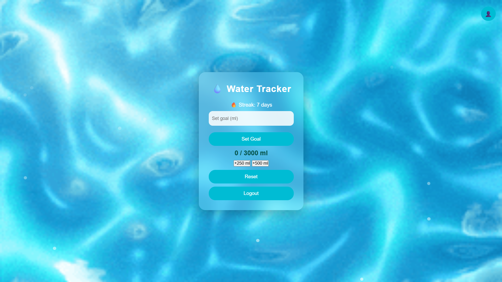
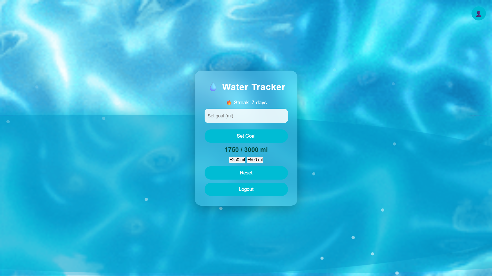
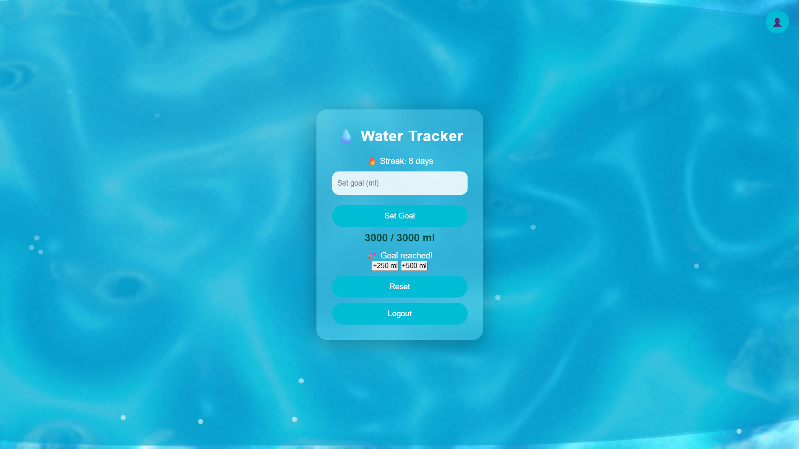
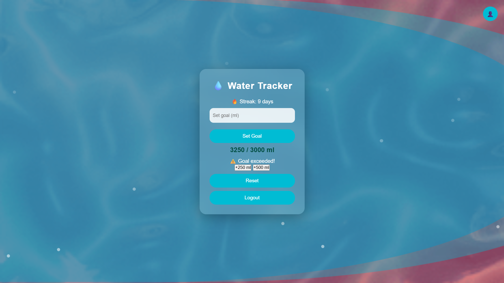

<p align="center">
  
</p>

# WATER TRACKER

## Basic Details

### Team Name: Pina Colada

### Team Members
- Member 1: Ashlena Rose - AISAT
- Member 2: Deeva K Samson - AISAT

### Hosted Project Link
https://water-tracker-hazel.vercel.app/index.html

### Project Description
are u drinking (water) everyday bbg? u sure u aint lying? if not track yo intake with this lil site baby.

### The Problem statement
People often forget to drink water

### The Solution
Since they have a tracker theyll have something to engage and remind themselves to hydrate <3

---

## Technical Details

### Technologies/Components Used

**For Software:**
- Languages used: JavaScript, HTML, CSS
- Frameworks used: Node.js (Express)
- Libraries used: Mongoose, CORS
- Tools used: VS Code, Git, GitHub, MongoDB Atlas, Render, Vercel

**For Hardware:**
- Main components: Computer or Laptop, Internet Connection
- Specifications: 
  • Minimum 4GB RAM  
  • Modern Web Browser (Chrome, Edge, Firefox)  
  • Stable Internet connection for backend communication  
- Tools required: 
  • VS Code (for development)
  • Git (version control)
  • Web browser (testing)

---

## Features

List the key features of your project:
- Feature 1: User Authentication System  
  Secure signup and login functionality using MongoDB database.

- Feature 2: Daily Water Tracking  
  Users can add water intake (+250ml / +500ml) and track real-time progress.

- Feature 3: Custom Goal Setting  
  Users can set their own daily water intake goal and monitor progress percentage.

- Feature 4: Animated Water Progress UI  
  Dynamic wave animation background with glow effects, bubbles, and overflow indicator when goal is exceeded.

- Feature 5: Daily Streak System  
  Tracks consecutive days of meeting water goals to encourage consistency.

- Feature 6: Reset Functionality  
  Allows users to reset daily water intake safely.

## Implementation

### For Software:

#### Installation

# Clone the repository
git clone https://github.com/crazyrider1115/water-tracker.git

# Go into project folder
cd water-tracker

# Install backend dependencies
cd backend
npm install

# (Frontend is static, no install needed)

#### Run

# Start backend server
cd backend
node server.js

# Frontend
# Open frontend/index.html in browser
# OR use Live Server in VS Code

### For Hardware:

#### Components Required
- Computer or Laptop
- Internet connection
- Web browser (Chrome/Edge recommended)

#### Circuit Setup
No physical hardware or circuit setup is required, as this is a fully web-based application.

---

## Project Documentation

### For Software:

#### Screenshots (Add at least 3)

<p align="center">
  
</p>
login page.

<p align="center">
  
</p>
Sign Up Page

<p align="center">
  
</p>
Home page. We can edit what out water intake goal for the day is.

<p align="center">
  
</p>
Filling water as tracked by user

<p align="center">
  
</p>
A text showing goal has been reached.

<p align="center">
  
</p>
the filled moving water gets a red shade when the goal intake is exceeded.

<p align="center">
  
</p>
Profile page with logout button

#### Diagrams

**System Architecture:**


*Explain your system architecture - components, data flow, tech stack interaction*

**Application Workflow:**


*Add caption explaining your workflow*

---

### For Hardware:

#### Schematic & Circuit


*Add caption explaining connections*


*Add caption explaining the schematic*

#### Build Photos

[Team]
<p align="center">
  
</p>
<p align="center">
  
</p>

*Components*
Frontend: HTML, CSS, JavaScript
Backend: Node.js with Express
Database: MongoDB Atlas
Deployment: Vercel (Frontend), Render (Backend)
Tools: VS Code, GitHub

*Build*
1. Designed the frontend using HTML, CSS, and JavaScript.
2. Developed backend APIs using Node.js and Express.
3. Integrated MongoDB Atlas for user authentication and data storage.
4. Connected frontend with backend using fetch API.
5. Implemented features like water tracking, goal setting, and streak system.
6. Deployed backend on Render and frontend on Vercel.

*Final*
Fully functional water tracking web application
Users can sign up, log in, and track daily water intake
Interactive UI with animated waves, bubbles, and progress tracking
Goal setting, streak tracking, and reset functionality included
Deployed and accessible online

---

## Additional Documentation

### For Web Projects with Backend:

#### API Documentation

**Base URL:** `https://api.yourproject.com`

##### Endpoints

**GET /api/endpoint**
- **Description:** [What it does]
- **Parameters:**
  - `param1` (string): [Description]
  - `param2` (integer): [Description]
- **Response:**
```json
{
  "status": "success",
  "data": {}
}
```

**POST /api/endpoint**
- **Description:** [What it does]
- **Request Body:**
```json
{
  "field1": "value1",
  "field2": "value2"
}
```
- **Response:**
```json
{
  "status": "success",
  "message": "Operation completed"
}
```

[Add more endpoints as needed...]

---

### For Mobile Apps:

#### App Flow Diagram


*Explain the user flow through your application*

#### Installation Guide

**For Android (APK):**
1. Download the APK from [Release Link]
2. Enable "Install from Unknown Sources" in your device settings:
   - Go to Settings > Security
   - Enable "Unknown Sources"
3. Open the downloaded APK file
4. Follow the installation prompts
5. Open the app and enjoy!

**For iOS (IPA) - TestFlight:**
1. Download TestFlight from the App Store
2. Open this TestFlight link: [Your TestFlight Link]
3. Click "Install" or "Accept"
4. Wait for the app to install
5. Open the app from your home screen

**Building from Source:**
```bash
# For Android
flutter build apk
# or
./gradlew assembleDebug

# For iOS
flutter build ios
# or
xcodebuild -workspace App.xcworkspace -scheme App -configuration Debug
```

---

### For Hardware Projects:

#### Bill of Materials (BOM)

| Component | Quantity | Specifications | Price | Link/Source |
|-----------|----------|----------------|-------|-------------|
| Arduino Uno | 1 | ATmega328P, 16MHz | ₹450 | [Link] |
| LED | 5 | Red, 5mm, 20mA | ₹5 each | [Link] |
| Resistor | 5 | 220Ω, 1/4W | ₹1 each | [Link] |
| Breadboard | 1 | 830 points | ₹100 | [Link] |
| Jumper Wires | 20 | Male-to-Male | ₹50 | [Link] |
| [Add more...] | | | | |

**Total Estimated Cost:** ₹[Amount]

#### Assembly Instructions

**Step 1: Prepare Components**
1. Gather all components listed in the BOM
2. Check component specifications
3. Prepare your workspace

*Caption: All components laid out*

**Step 2: Build the Power Supply**
1. Connect the power rails on the breadboard
2. Connect Arduino 5V to breadboard positive rail
3. Connect Arduino GND to breadboard negative rail

*Caption: Power connections completed*

**Step 3: Add Components**
1. Place LEDs on breadboard
2. Connect resistors in series with LEDs
3. Connect LED cathodes to GND
4. Connect LED anodes to Arduino digital pins (2-6)

*Caption: LED circuit assembled*

**Step 4: [Continue for all steps...]**

**Final Assembly:**

*Caption: Completed project ready for testing*

---

### For Scripts/CLI Tools:

#### Command Reference

**Basic Usage:**
```bash
python script.py [options] [arguments]
```

**Available Commands:**
- `command1 [args]` - Description of what command1 does
- `command2 [args]` - Description of what command2 does
- `command3 [args]` - Description of what command3 does

**Options:**
- `-h, --help` - Show help message and exit
- `-v, --verbose` - Enable verbose output
- `-o, --output FILE` - Specify output file path
- `-c, --config FILE` - Specify configuration file
- `--version` - Show version information

**Examples:**

```bash
# Example 1: Basic usage
python script.py input.txt

# Example 2: With verbose output
python script.py -v input.txt

# Example 3: Specify output file
python script.py -o output.txt input.txt

# Example 4: Using configuration
python script.py -c config.json --verbose input.txt
```

#### Demo Output

**Example 1: Basic Processing**

**Input:**
```
This is a sample input file
with multiple lines of text
for demonstration purposes
```

**Command:**
```bash
python script.py sample.txt
```

**Output:**
```
Processing: sample.txt
Lines processed: 3
Characters counted: 86
Status: Success
Output saved to: output.txt
```

**Example 2: Advanced Usage**

**Input:**
```json
{
  "name": "test",
  "value": 123
}
```

**Command:**
```bash
python script.py -v --format json data.json
```

**Output:**
```
[VERBOSE] Loading configuration...
[VERBOSE] Parsing JSON input...
[VERBOSE] Processing data...
{
  "status": "success",
  "processed": true,
  "result": {
    "name": "test",
    "value": 123,
    "timestamp": "2024-02-07T10:30:00"
  }
}
[VERBOSE] Operation completed in 0.23s
```

---

## Project Demo

### Video
https://drive.google.com/file/d/1r8Zt1aSrMHwQqQ1Szlglcwrp0JCJPibg/view?usp=drive_link

---

## AI Tools Used (Optional - For Transparency Bonus)

If you used AI tools during development, document them here for transparency:

**Tool Used:** ChatGPT

**Purpose:** Mostly debugging and documentation. For styling and stuff.

**Key Prompts Used:**
- "Create a REST API endpoint for user authentication"
- "Debug this async function that's causing race conditions"
- "Optimize this database query for better performance"

**Percentage of AI-generated code:** 10%

**Human Contributions:**
- Architecture design and planning
- Custom business logic implementation
- Integration and testing
- UI/UX design decisions

---

## Team Contributions

- Ashlena Rose: Frontend development, UI/UX design, Database design etc.
- Deeva K Samson: Backend development, Testing, Documentation etc.

---

## License

This project is licensed under the [LICENSE_NAME] License - see the [LICENSE](LICENSE) file for details.

**Common License Options:**
- MIT License (Permissive, widely used)
- Apache 2.0 (Permissive with patent grant)
- GPL v3 (Copyleft, requires derivative works to be open source)

---

Made with ❤️ at TinkerHub
